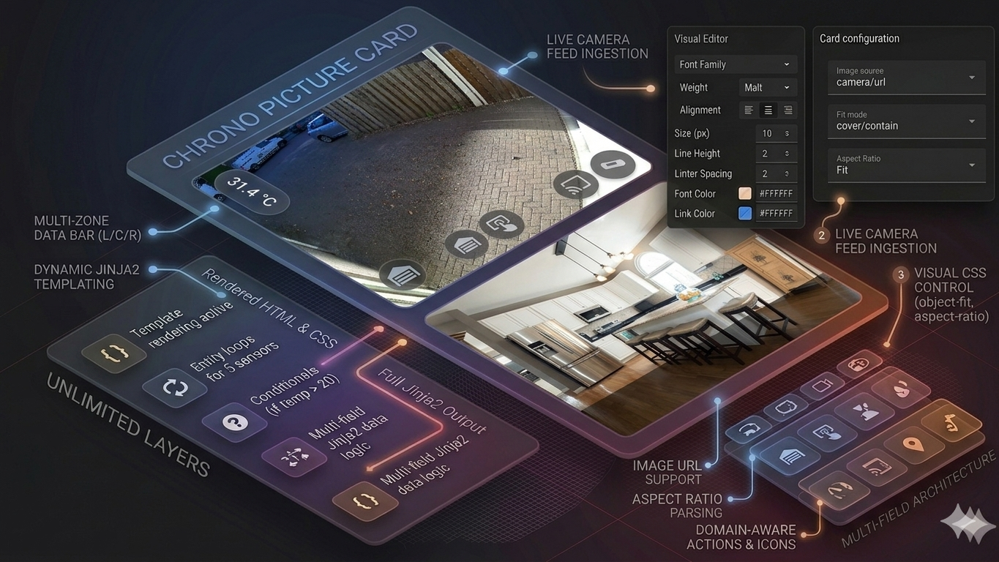

  
 <div align="center">

  [](https://github.com/hacs/integration)
  [](https://www.gnu.org/licenses/agpl-3.0)
  [](#)

  


  

  <p align="center">
    <strong>A flexible multi-field text card for Home Assistant dashboards.<br>
            Each field is independently styled and supports<br>
            Gauge, HTML, and live Jinja2 templates.</strong>
  </p>

  <p align="center">
    <a href="#introduction">Introduction</a> •
    <a href="#key-features">Key Features</a> •
    <a href="#installation">Installation</a> •
    <a href="#configuration">Configuration</a> •
    <a href="#license">License</a>
  </p>

</div>

---

**Chrono Gauge Card** is a drop-in replacement and upgrade for Home Assistant's built-in Gauge card. Instead of a fixed title and content structure, it renders any number of independently styled text fields stacked vertically inside a single card. Each field supports Gauge, raw HTML, and live Jinja2 templates — so any configuration that works in the standard Gauge card works here too, with zero migration effort.

The card matches the default appearance of HA's Gauge card exactly out of the box, while adding a full visual editor with per-field typography, color, border, and spacing controls that the standard card simply does not offer.

---

## 📋 Table of Contents

- [Introduction](#introduction)
- [Key Features](#key-features)
- [Installation](#installation)
  - [HACS (Recommended)](#hacs-recommended)
  - [Manual Installation](#manual-installation)
- [Uninstallation](#uninstallation)
- [Configuration](#configuration)
  - [Card Options](#card-options)
  - [Field Options](#field-options)
- [License](#license)
- [Support](#support)

---

## 🚀 Key Features

### 📝 Multiple Independent Text Fields
The card renders any number of text fields stacked vertically. Each field is configured independently — font size, weight, color, alignment, line height, background, border, and padding are all per-field settings. Add as many fields as you need; remove them just as easily via the visual editor.

### ✍️ Gauge, HTML, and Jinja2 — All at Once
Each field's content is evaluated as a Jinja2 template (via Home Assistant's WebSocket connection) and then rendered through the same Gauge engine used by HA's own Gauge card. Raw HTML is fully supported alongside Gauge in the same content field. Any content that works in HA's standard Gauge card works here without modification.

### 🎨 Full Per-Field Styling
Every field has its own typography controls (font size in em, font weight, text alignment, line height), color controls (text color and background color), border controls (width, style, color, radius), and padding controls (top, bottom, left, right). Styling is applied cleanly without inline style conflicts — empty values fall back to Home Assistant's active theme automatically.

### 🎭 HA Theme Aware
All default colors respect Home Assistant's active theme via CSS custom properties. Card background, border color, and text color all follow the theme. Switching themes updates the card instantly without any configuration changes.

### 🔄 Seamless Migration from HA's Gauge Card
The card is designed as a drop-in replacement. Copy the content from any existing Gauge card, paste it into a Chrono Gauge Card field, and it renders identically. No syntax changes, no reformatting required.

### 🛠️ Full Visual Editor
Every property — card-level and per-field — is configurable through the Lovelace UI editor. YAML editing is never required. Fields can be added, removed, shown, and hidden directly from the editor.

---

## 📦 Installation

### HACS (Recommended)

1. Open **HACS** in your Home Assistant instance.
2. Navigate to **Frontend** and click the three-dot menu in the top right corner.
3. Select **Custom repositories**.
4. Enter `https://github.com/rob-vandenberg/chrono-gauge-card` and select **Lovelace** as the category.
5. Click **Add**. The repository will appear in the list.
6. Search for `Chrono Gauge Card` and click **Download**.
7. Reload your browser.

### Manual Installation

1. Download `chrono-gauge-card.js` from the [latest release](https://github.com/rob-vandenberg/chrono-gauge-card/releases/latest).
2. Copy it to your Home Assistant `config/www/` folder.
3. In Home Assistant, go to **Settings → Dashboards → Resources**.
4. Click **Add Resource**.
5. Enter `/local/chrono-gauge-card.js` as the URL and select **JavaScript Module**.
6. Click **Create** and reload your browser.

---

## 🗑️ Uninstallation

### Via HACS
1. Open **HACS → Frontend**.
2. Find **Chrono Gauge Card** and click the three-dot menu.
3. Select **Remove**.
4. Reload your browser.

### Manual
1. Delete `chrono-gauge-card.js` from `config/www/`.
2. Remove the resource entry from **Settings → Dashboards → Resources**.

---


---

## ⚙️ Configuration

### Card Options

These properties apply to the entire card container.

| Property | Type | Default | Description |
| :--- | :--- | :--- | :--- |
| `background_color` | string | HA theme | Card background color. Empty = HA theme default. |
| `padding_top` | number | `8` | Inner padding top in px |
| `padding_bottom` | number | `8` | Inner padding bottom in px |
| `padding_left` | number | `8` | Inner padding left in px |
| `padding_right` | number | `8` | Inner padding right in px |
| `border_color` | string | HA theme | Border color. Empty = HA theme default. |
| `border_width` | number | `1` | Border width in px |
| `border_radius` | number | `12` | Border radius in px |
| `border_style` | string | `solid` | Border style (`solid`, `dashed`, `dotted`, `none`, or any valid CSS value) |

### Field Options

Each entry in the `fields` array has the following properties.

| Property | Type | Default | Description |
| :--- | :--- | :--- | :--- |
| `name` | string | `''` | Editor-only label shown in the field panel header. Not rendered in the card. |
| `show` | boolean | `true` | Show or hide this field |
| `line_breaks` | boolean | `false` | When enabled, a single Enter key creates a new line in the rendered output. When disabled, two Enter keys are required (standard Gauge paragraph behaviour). |
| `content` | string | `''` | Field content. Supports Gauge, HTML, and Jinja2 templates. |
| `color` | string | HA theme | Text color. Empty = HA theme default (`--primary-text-color`). |
| `font_size` | number | `1.0` | Font size in em. Gauge headings (`#`, `##`, etc.) scale proportionally relative to this value. |
| `font_weight` | number | `400` | Font weight |
| `line_height` | number | `1.4` | Line height (unitless multiplier) |
| `text_align` | string | `left` | Text alignment (`left`, `center`, `right`, or any valid CSS value) |
| `background_color` | string | `''` | Field background color. Empty = transparent. |
| `padding_top` | number | `8` | Padding top in px |
| `padding_bottom` | number | `8` | Padding bottom in px |
| `padding_left` | number | `8` | Padding left in px |
| `padding_right` | number | `8` | Padding right in px |
| `border_color` | string | HA theme | Border color. Empty = HA theme default. |
| `border_width` | number | `0` | Border width in px |
| `border_radius` | number | `12` | Border radius in px |
| `border_style` | string | `solid` | Border style |

### Example YAML

```yaml
type: custom:chrono-gauge-card
fields:
  - name: Title
    show: true
    content: "## Today's Weather"
    font_size: 1.2
    text_align: center
  - name: Content
    show: true
    line_breaks: true
    content: >-
      The temperature is **{{ states('sensor.outdoor_temperature') }}°C**
      with {{ states('sensor.weather_condition') }} skies.
    font_size: 1.0
    text_align: left
```

---

## ⚖️ License

**GNU Affero General Public License v3.0 (AGPL-3.0)**

This project is licensed under the AGPL-3.0. You are free to use, modify, and distribute this software, provided that any modifications or derivative works that are made available — including over a network — are also distributed under the same license.

Full license text: [https://www.gnu.org/licenses/agpl-3.0](https://www.gnu.org/licenses/agpl-3.0)

Copyright © 2026 Rob Vandenberg. All rights reserved.

---

## ☕ Support

If you find this project useful and wish to support its continued development, please consider a contribution.

[](https://www.buymeacoffee.com/)
